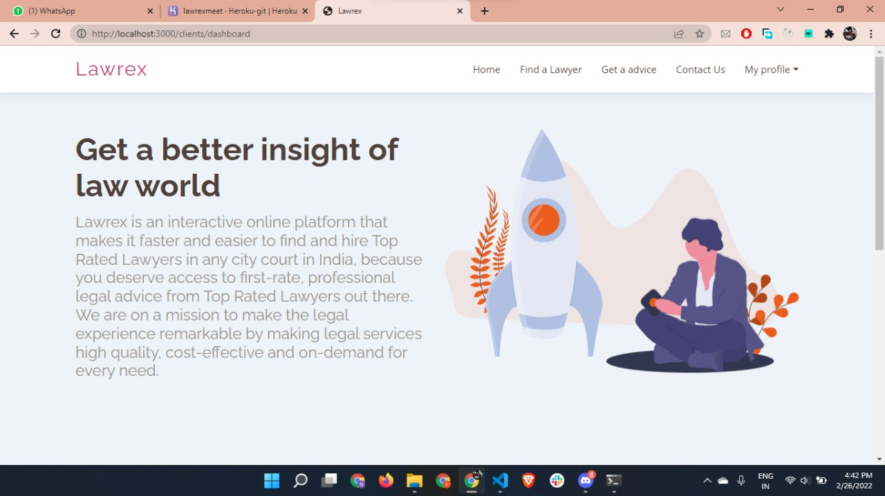
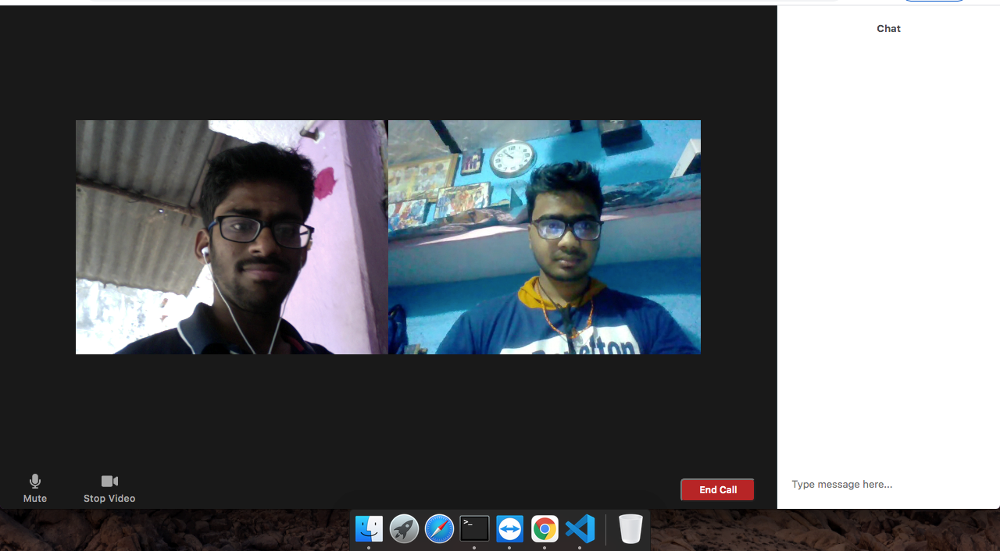
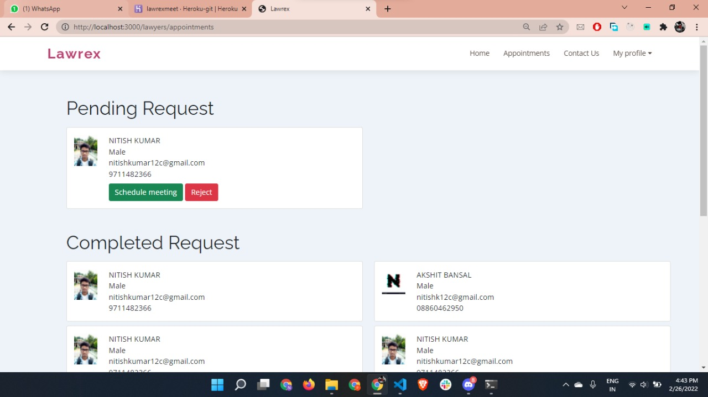
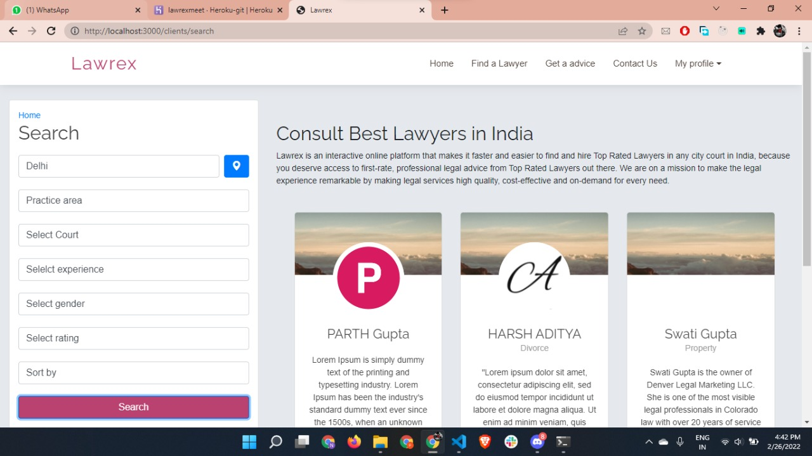
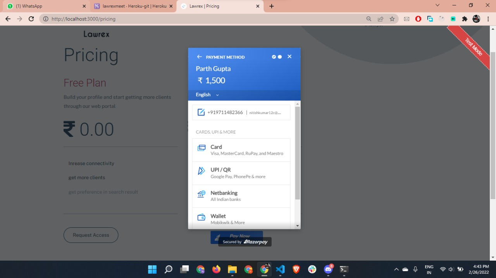
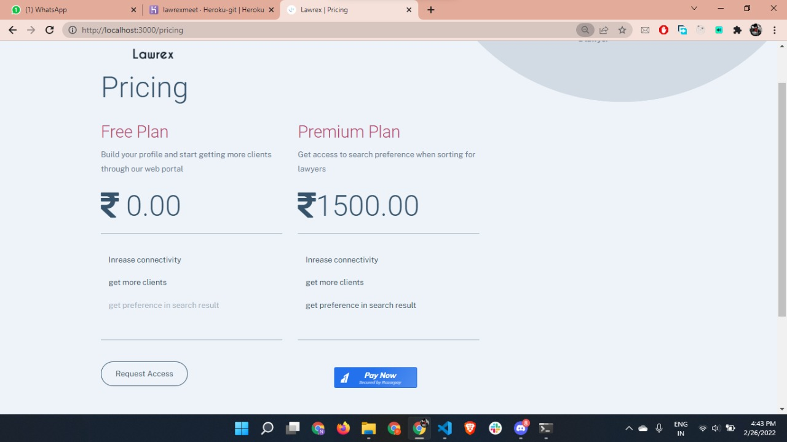
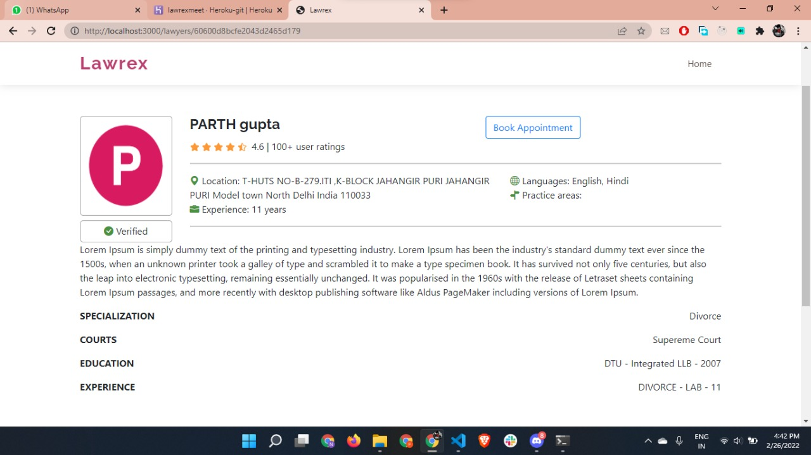
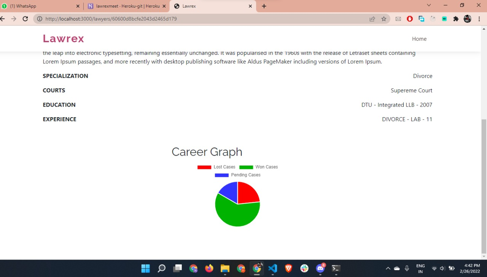
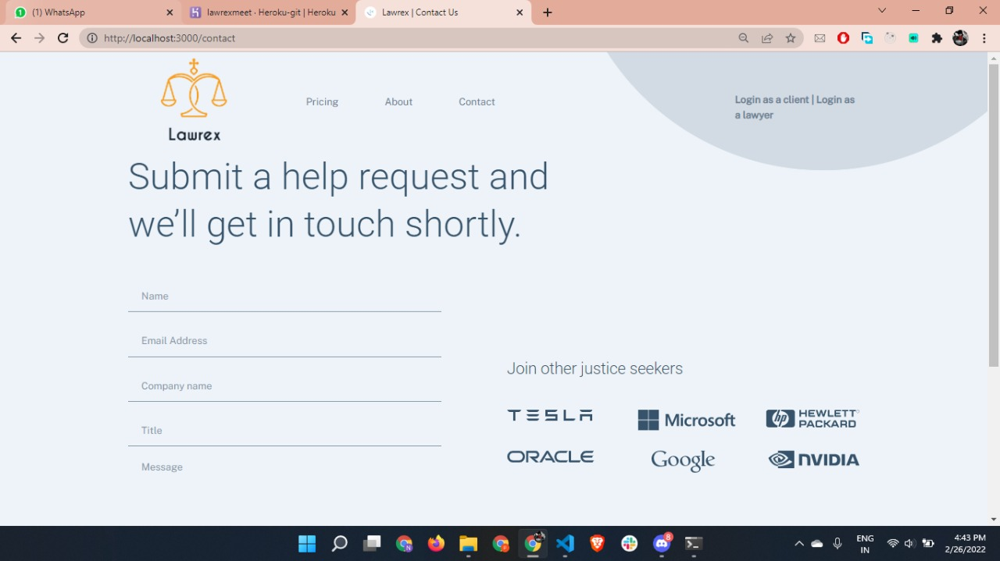

#### _Lawrex_

#### Overview

_Lawrex is a web application which is used to connect users to top rated lawyers according to their budget and needs which will also help lawyers get more clients. Our objectives for this project are -_

- _Design an effective system where we can connect with lawyers easily._
- _People who need legal advice can consult legal advisers online._
- _Increase the number of clients for independent lawyers._
- _Justice seekers who are in extreme need of top rated lawyers, can find them according to their budget._

#### Technology used

_The following technologies will be used to make this application -_
- _Express_
- _Multer_
- _Passport_
- _Mongoose_
- _MongoDB Atlas_
- _Razorpay API_
- _ejs_
- _ipinfo api_
- _Heroku_
  

#### PPT LINK
https://docs.google.com/presentation/d/12vdOG1mqgGB2ahSkocySrbJFBts7_9HbTquAPcuV1-I/edit?usp=sharing

#### demo video LINK
still working

#### WEBSITE LINK

#### Screenshots/

### Usage
Follow these steps to run the application on your local machine - 
1. Clone this Repo to your Local Machine.
2. Open The Terminal/CMD in the folder haxplore-2.0-Xterminate.
3. Run command "npm i" which will install all the node modules required to run this project
4. Then run command "npm start" to start server
5. Open "localhost:3000" on your browser to use web application

